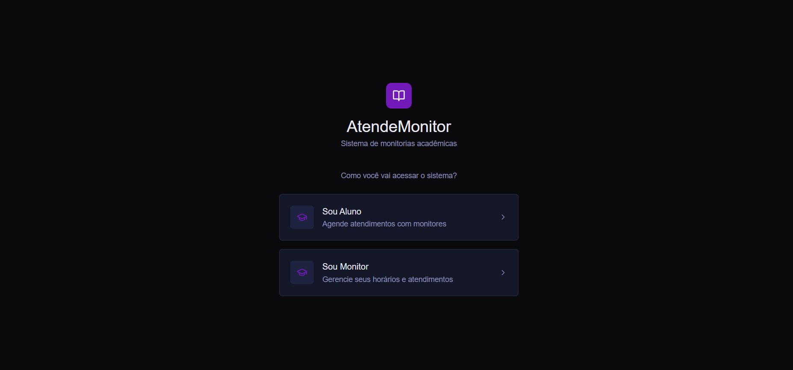
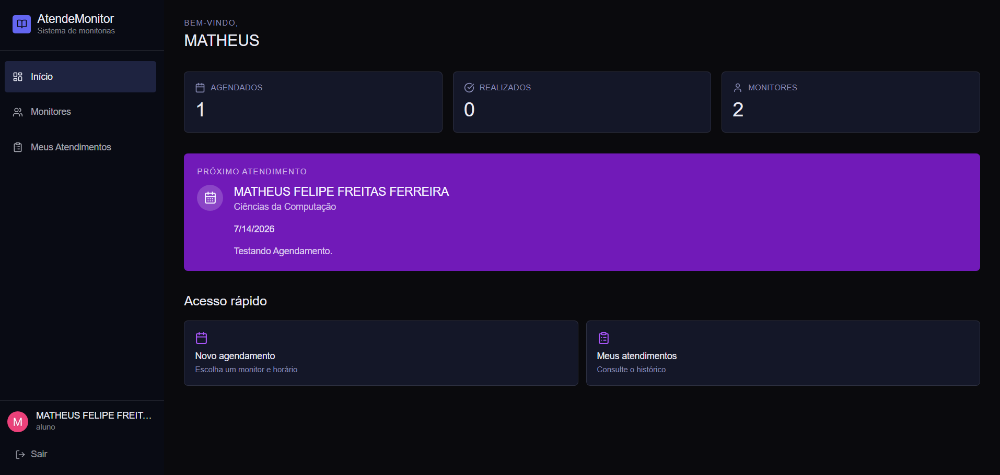
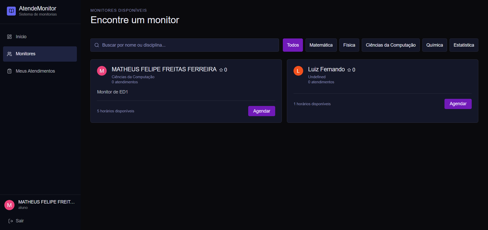
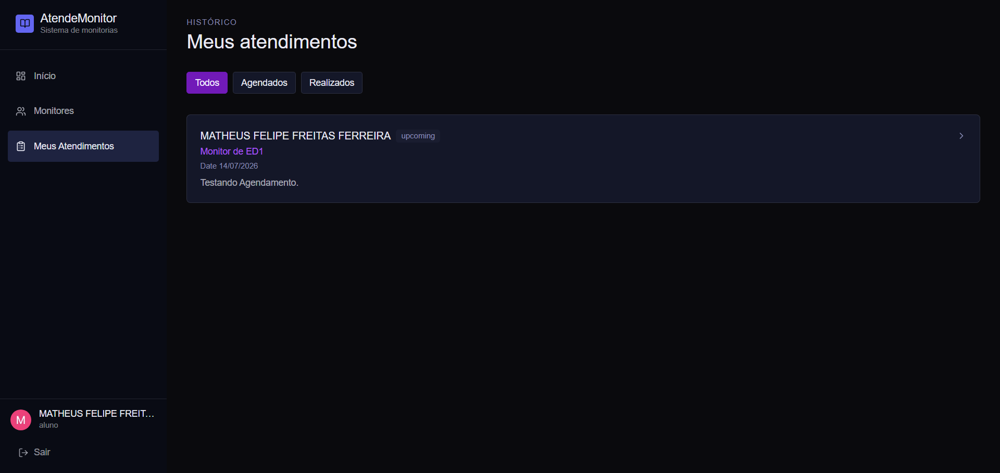
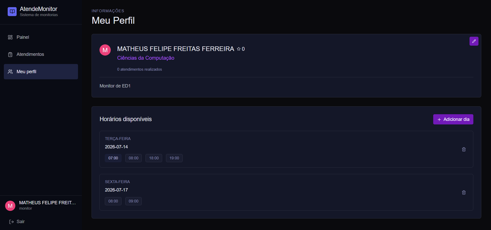

# 📚 Atende Monitor

Atende Monitor is a web application designed to simplify the scheduling and management of academic tutoring sessions. The platform provides dedicated interfaces for both **students** and **monitors**, allowing users to schedule, manage, and track tutoring appointments in an organized way.

The project was developed using **Next.js**, featuring authentication, database integration with Prisma, and a modern responsive interface built with Tailwind CSS and shadcn components.

---

## 🚀 Main Features

### 👨‍🎓 Student

- 📅 Schedule tutoring sessions
- ❌ Cancel scheduled sessions
- 🔎 Search for available monitors
- 📋 View personal tutoring appointments
- 📊 Dashboard with important information and upcoming sessions

### 👨‍🏫 Monitor

- 📅 View scheduled tutoring sessions
- ➕ Create new tutoring appointments
- ❌ Cancel appointments
- 🔄 Change appointment status
- 👤 Edit profile information
- 📊 Dashboard with tutoring information and statistics

---

## 📸 Screenshots

Here are some screenshots showing the main features of the application.

### 🔐 Authentication



---

### 👨‍🎓 Student Dashboard



---

### 🔎 Monitor Search



---

### 📅 Appointments Management



---

### 👨‍🏫 Monitor Dashboard



---

## 📑 Pages

### Student

- **Home** – Dashboard containing main information and upcoming tutoring sessions
- **Monitors** – Search, view available monitors and schedule appointments with tutors
- **Appointments** – Manage scheduled tutoring sessions

### Monitor

- **Home** – Dashboard with tutoring overview
- **Appointments** – Manage tutoring requests and scheduled sessions
- **Profile** – Edit monitor information

---

## 🔐 Authentication

Authentication is implemented using **NextAuth (Auth.js)** with Prisma integration.

The system supports different user roles:

- 👨‍🎓 Student
- 👨‍🏫 Monitor

Each role has different permissions and access to specific functionalities.

---

## 🛠️ Tech Stack

### Frontend

- Next.js 16
- React 19
- TypeScript
- Tailwind CSS 4
- shadcn/ui
- Base UI
- lucide-react

### Backend / Database

- Next.js Server Actions / API Routes
- Prisma ORM
- MongoDB *(or configured database)*

### Authentication

- NextAuth.js v5
- @auth/prisma-adapter

### Validation & Forms

- Zod

### UI / Feedback

- Sonner
- class-variance-authority
- clsx
- tailwind-merge
- tw-animate-css

---

## ⚙️ Getting Started

Follow the steps below to run the project locally.

Clone the repository:
```bash
git clone https://github.com/Dev-Matheus-Felipe/Monitor_Assist.git
```
Navigate to the project directory:

```bash
cd Monitor_Assist
```
Install the dependencies:

```bash
npm install
```
Create a .env file in the root of the project and configure the following variables:
```bash

DATABASE_URL="your mongodb database url"
NODE_ENV="development"

AUTH_GOOGLE_ID=your_google_client_id
AUTH_GOOGLE_SECRET=your_google_client_secret

NEXTAUTH_URL=http://localhost:3000
AUTH_TRUST_HOST=true
```

Generate Prisma Client and Next Auth Secret:
```bash
npx auth secret

npx prisma generate
```
Run the development server:

```bash
npm run dev
# or
yarn dev
# or
pnpm dev
# or
bun dev
```

Open your browser and access:

```
http://localhost:3000
```

---

## 📚 Project Overview

Atende Monitor was created to improve the organization of academic tutoring services.

The application connects students and monitors through an appointment management system.

Students can:

- Find available monitors
- Schedule tutoring sessions
- Cancel appointments
- Track their tutoring activities

Monitors can:

- Manage their tutoring schedule
- Create new available sessions
- Update appointment status
- Maintain their profile
- Monitor activities through a dashboard

---

## 💡 Notes

- The application uses role-based access control between students and monitors.
- Each user type has its own dashboard and available actions.
- Appointment statuses help organize the tutoring workflow.

---

Feel free to contribute or open issues if you find any bugs or have suggestions.